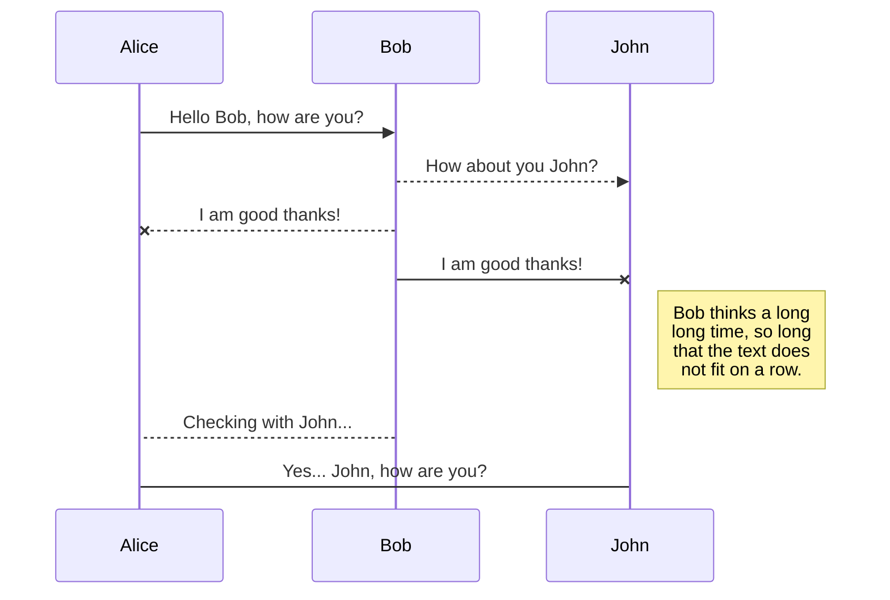
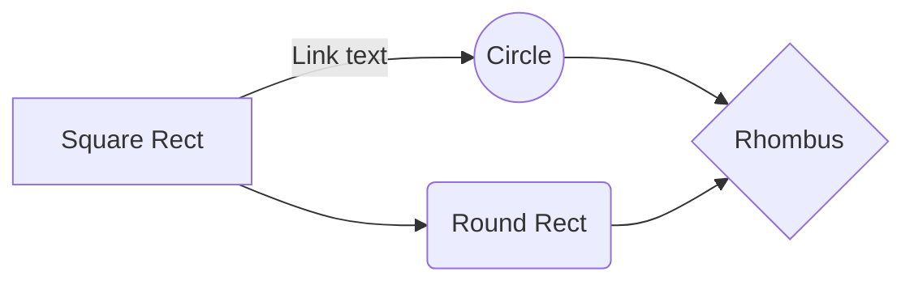

# React Native Job Board

An application in React Native to search Job listings near your area. User will go to map and get his location where to search. It will trigger API search for jobs in that location. User can then apply for jobs, from the search list based on description.

Technologies used : 

 - React Native
 - Map : react-native-maps
 - Navigation
 - Facebook Authentication
 - Github jobs		

# Installation
On your terminal type

    npm install

I am using react-navigation v5 which is different from v4 in many respect.

# Screens
 - WelcomeScreen
 - AuthScreen
 - MapScreen
 - DeckScreen
 - ReviewScreen
 - SettingScreen

### Welcome Screen

Welcome screen shows manual for the App. Three or more slides are shown with a button at last slide to trigger navigation to Auth screen. The Welcome Screen is shown only to unregistered users, after the user is authenicated, the screen need not be shown.

### Auth Screen
Auth screen is for authenication of the user using facebook login. We used expo-facebook authentication method.

### Map Screen
User sets location on the map to view jobs. Once the location is set, the user gets job listings for nearby location set on the map screen. Github jobs has jobs listing mostly from Americal and Europe. I did not find any jobs in India at time of testing.

### Deck Screen
The Deck screen shows the listings of jobs for that location. Presently, the jobs shows only for **Javascript** profile. The deck has cards of jobs which can be **swiped left** to *discard* and **swiped right** to *apply*. Cards swiped right move to myJobs which is review screen.

### Review Screen
The Review Screen is the myJobs screen where we get jobs which we have filtered to apply. 

## Settings Screen
The user setting screen is where we can clear map location and myJobs lists. 

# Flow Diagrams
### Auth Screen
[](https://mermaid-js.github.io/mermaid-live-editor/#/edit/eyJjb2RlIjoiZ3JhcGggVERcblx0QVtBdXRoIFNjcmVlbl0gLS0-fEluaXRpYXRlIEZiIGxvZ2lufCBCe0lzIEF1dGhlbnRpY2F0ZWR9XG5cdEIgLS0-fFllc3wgQ1tTZW5kIHRvIE1hcFNjcmVlbl1cblx0QiAtLT58Tm98IERbQXR0ZW1wdCB0byBsb2dpbiB3aXRoIEZhY2Vib29rXVxuXHREIC0tPiBFW0dldCBUb2tlbl1cblx0RSAtLT58U2F2ZSBUb2tlbiBmb3IgZnV0dXJlfCBDXG5cdFx0XHRcdFx0IiwibWVybWFpZCI6eyJ0aGVtZSI6ImRlZmF1bHQifSwidXBkYXRlRWRpdG9yIjpmYWxzZX0)


# Settings for facebook authenication on Expo
Create a facebook developer account if not already have. Create a new app so that you get App ID and secret key.
From Developer Console: Goto Settings -> Basic -> Add Platform.
- Select iOS. On the Bundle ID field add *host.exp.Exponent* 
- Select Android platform. On the Key Hash field add *rRW++LUjmZZ+58EbN5DVhGAnkX4=*  . This is Expo Client key hash.
Save the changes.

In your code 
use Facebook API from expo-facebook  **```expo install expo-facebook```**
    
    ```javascript import {Facebook} from 'expo';

            const loginFun = async () => {
                const [type,token] = await Facebook.logInWithReadPermissionsAsync('APP_ID',
                                        {permissions:['public_profile]}
                                    );
                if(type === 'success') {
                    // logged in
                } else {
                    // type === 'cancel'
                    // login failed
                }
            }
    ```

## UML diagrams

You can render UML diagrams using [Mermaid](https://mermaidjs.github.io/). For example, this will produce a sequence diagram:



And this will produce a flow chart:



# Problems and Resolutions 
 - **Customising the navigation header/bar.** Each screen can configure various aspects about how it gets presented in the navigator that renders it.
 In reactnavigation <v5 we could use 
```javascript
	 class ReviewScreen extends Component {
            static navigationOptions = {
                    headerRight: () => (
                    <Button  title="Setting"
                        titleStyle={{ color: "rgba(0,122,255,1)", }}
                        buttonStyle={{backgroundColor:'transparent'}}
                        onPress={() => navigation.navigate('Setting')}
                    />
                    ),
		    };
		  render()  {
			  // ...
			}
	}
```
 With React Navigation 5.x, we need to pass the configuration when defining the screen:

```javascript
	<Stack.Screen   name="Review"
            component={ReviewScreen}
            options={({ navigation, }) => ({
            title:'Review Jobs',
            headerTitle:'Review',
            headerRight: () => (
                <Button  title="Setting"
                    titleStyle={{ color: "rgba(0,122,255,1)", }}
                    buttonStyle={{backgroundColor:'transparent'}}
                    onPress={() => navigation.navigate('Setting')}
                />
            ),
        })}
	/>
```

- **Map screen was showing blank with no errors**
    
    Solution was to provide width and height in style configuration.

    ```javascript
        mapStyle: {
            width: Dimensions.get('window').width,
            height: Dimensions.get('window').height,
        },
    ```    
    ```Dimensions``` being imported from 'react-native'

- **AsycStorage is depricated**
   Use react-native async-storage
   ```npm i @react-native-community/async-storage```
   

# Scope of Improvement in next version
- A text input where user can set his criteria to search job terms like Java, React, Mobile, .Net etc. Presetly there is search for Javascript only.
- 