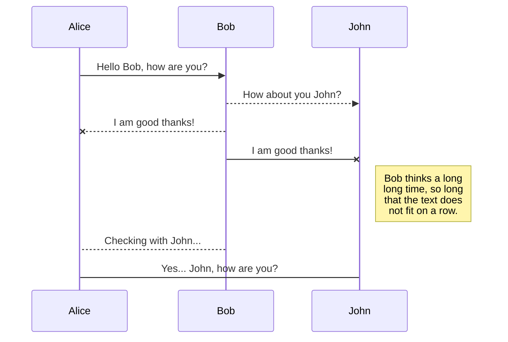
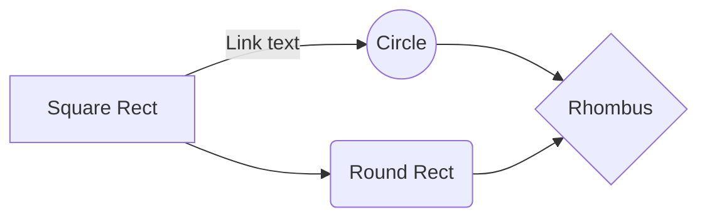

# React Native Job Board

An application in React Native to search Job listings near your area. User will go to map and get his location where to search. It will trigger API search for jobs in that location. User can then apply for jobs, from the search list based on description.
Technologies used : 

 - Firebase (database and authentication)
 - Twilio (send OTP message)
 - Map
 - Navigation		

## Screens

## UML diagrams

You can render UML diagrams using [Mermaid](https://mermaidjs.github.io/). For example, this will produce a sequence diagram:

And this will produce a flow chart:

